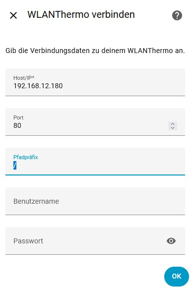
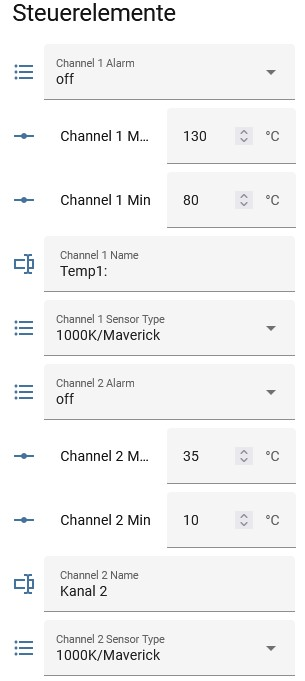
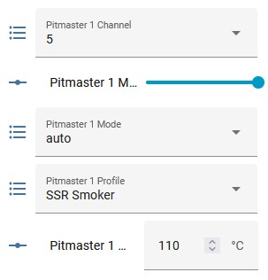
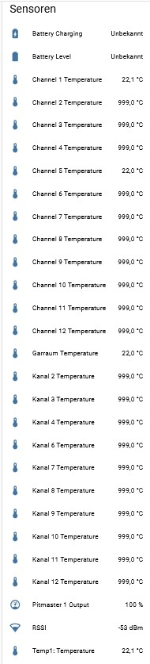
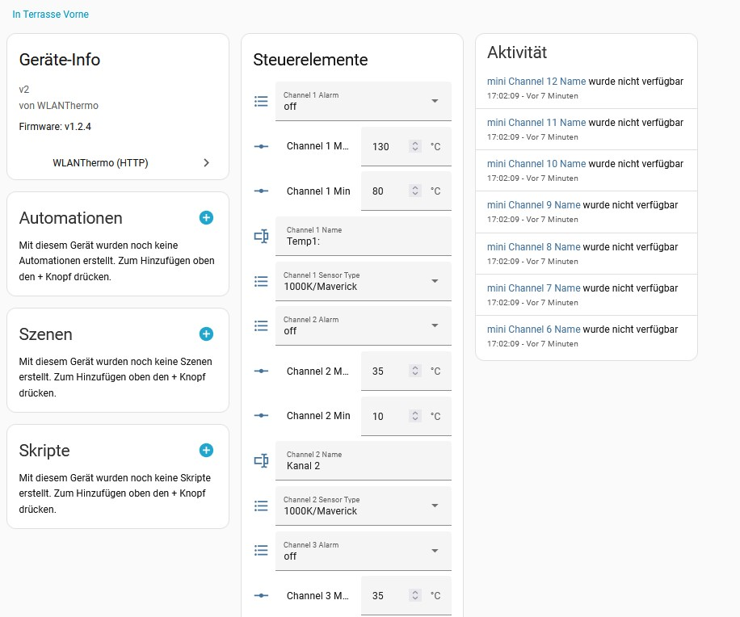

# WLANThermo (ESP32) — Home Assistant Custom Integration

**Version:** 0.1.0  
**Code Owner Main Repository:** @lemuba  
**License:** MIT

> **Attribution & Disclaimer**  
> This is a **fork** of the original WLANThermo Home Assistant integration. 
> **No support** is provided by the repository owner. Forks and community **development/bugfixes** are welcome.  
> **No warranty/liability** — use at your own risk.

## API Reference
- Official HTTP API: https://github.com/WLANThermo-nano/WLANThermo_ESP32_Software/wiki/HTTP
- Use lowercase routes (`/setpitmaster`, `/setchannels`, `/setpid`, `/setsystem`).
- For Pitmaster writes, send **complete nested** PM objects in an array.

## Features
- **Pitmaster 1 only** (Pitmaster 2 intentionally removed).
- **Pitmaster 1 Output** sensor (controller duty in %).
- Per-channel temperature sensors (from `/data.channel[]`), two variants:
  - `<Channel name> Temperature`
  - **Fixed**: `Channel X Temperature` (name-independent)
- **Channel Alarm** select: `off`, `push`, `buzzer`, `push+buzzer` → `/setchannels`
- **Channel Sensor Type** select (from `/settings.sensors[]`) → `/setchannels`
- **Channel Min/Max** numbers (range **−30…+350 °C**) → `/setchannels`
- System sensors: **RSSI**, **Battery Level**, **Battery Charging**
- **Offline-tolerant startup** (entities become available when the device is online).

## Manual Installation
1. Extract this repository.
2. Copy `custom_components/wlanthermo` into `<HA config>/custom_components/`.
3. Restart Home Assistant.

## Setup
- Settings → Devices & Services → **Add Integration** → **WLANThermo**.
- Provide host/port; credentials if required.

## Screenshots

**Setup dialog**  

**Channel control entities**  

**Pitmaster 1 settings**  

**Sensors (temperatures, output, RSSI, battery)**  

**Device page in Home Assistant**  

